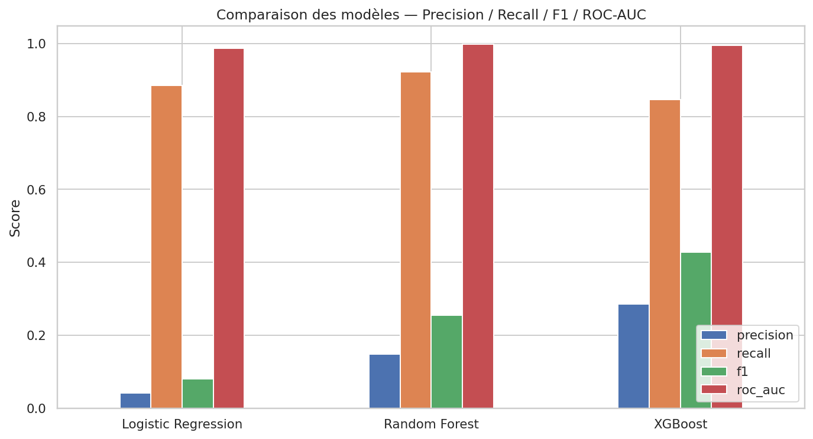
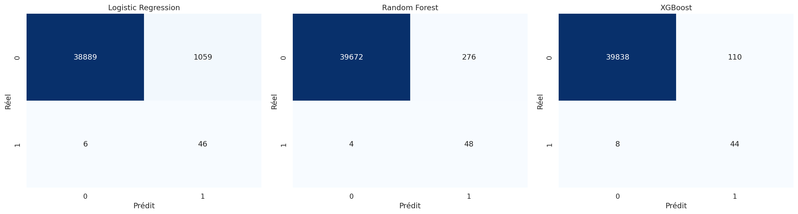
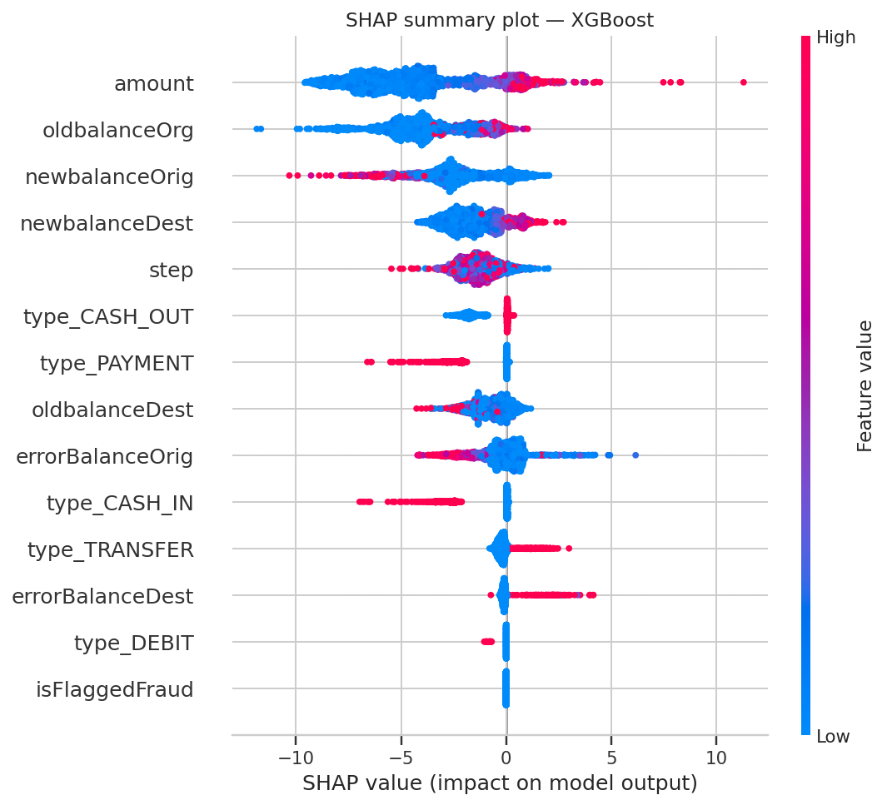

# 🏦 fraud-detection-ml

Détection de fraude sur les paiements en ligne — EDA complète, gestion du déséquilibre des classes (SMOTE), comparaison de trois modèles de classification (Logistic Regression, Random Forest, XGBoost), interprétabilité (feature importance + SHAP) et interface interactive de prédiction.


## Sommaire

- [Aperçu](#aperçu)
- [Dataset](#dataset)
- [Structure du projet](#structure-du-projet)
- [Installation](#installation)
- [Utilisation](#utilisation)
- [Méthodologie](#méthodologie)
- [Résultats](#résultats)
- [Interface de prédiction](#interface-de-prédiction)
- [Pistes d'amélioration](#pistes-damélioration)

## Aperçu

Les transactions frauduleuses représentent une part infime (~0,1 %) des paiements en ligne, ce qui rend leur détection difficile pour un modèle naïf. Ce projet construit un pipeline complet :

1. **EDA** — distribution de la cible, fraude par type de transaction, analyse des montants, incohérences de solde, corrélations.
2. **Feature engineering** — encodage du type de transaction, variables d'erreur de solde (`errorBalanceOrig`, `errorBalanceDest`) fortement corrélées à la fraude.
3. **Gestion du déséquilibre** — SMOTE appliqué uniquement sur l'ensemble d'entraînement (pas de fuite de données).
4. **Modélisation** — Logistic Regression (baseline interprétable), Random Forest, XGBoost.
5. **Évaluation** — Precision, Recall, F1-score, ROC-AUC, matrices de confusion, courbes ROC comparées.
6. **Interprétabilité** — feature importance (RF, XGBoost) et SHAP summary plot.
7. **Interface** — application Streamlit pour tester une transaction en direct.

## Dataset

Le projet s'appuie sur le schéma du dataset **PaySim / Online Payments Fraud Detection** (Kaggle) : `step`, `type`, `amount`, `nameOrig`, `oldbalanceOrg`, `newbalanceOrig`, `nameDest`, `oldbalanceDest`, `newbalanceDest`, `isFraud`, `isFlaggedFraud`.

Le fichier original (~470 Mo, 6,3M lignes) est trop volumineux pour être versionné ici. `data/generate_sample_data.py` génère un jeu de données **synthétique** de 200 000 lignes qui reproduit fidèlement le schéma et les propriétés statistiques du dataset réel (déséquilibre ~0,13 %, fraude concentrée sur `TRANSFER`/`CASH_OUT`, incohérences de solde corrélées à la fraude), afin que tout le pipeline soit reproductible de bout en bout.

**Pour utiliser le vrai dataset :**
1. Télécharger `onlinefraud.csv` depuis [Kaggle](https://www.kaggle.com/datasets/rupakroy/online-payments-fraud-detection-dataset)
2. Le placer dans `data/online-payments_fraud.csv`
3. Relancer `src/train.py` — aucune autre modification nécessaire.

## Structure du projet

```
fraud-detection-ml/
├── data/
│   └── generate_sample_data.py     # génère le dataset synthétique (schéma PaySim)
├── notebooks/
│   └── online_payments_fraud_detection.ipynb   # EDA + modélisation, exécuté de bout en bout
├── src/
│   ├── preprocessing.py            # feature engineering, partagé notebook / train / app
│   └── train.py                    # pipeline complet : EDA -> SMOTE -> modèles -> évaluation -> sauvegarde
├── app/
│   └── app.py                      # interface Streamlit de prédiction
├── models/                         # modèles entraînés (.joblib), générés par train.py
├── reports/
│   ├── figures/                    # graphiques exportés par train.py
│   ├── model_comparison.csv
│   └── metrics.json
├── requirements.txt
└── README.md
```

## Installation

```bash
git clone https://github.com/dohamly/fraud-detection-ml.git
cd fraud-detection-ml
python -m venv venv && source venv/bin/activate   # optionnel
pip install -r requirements.txt
```

## Utilisation

```bash
# 1. Générer le dataset (ou placer le vrai fichier Kaggle dans data/)
python data/generate_sample_data.py

# 2. Lancer le pipeline complet : EDA, SMOTE, entraînement, évaluation, SHAP, sauvegarde des modèles
python src/train.py

# 3. Explorer le notebook (EDA + modélisation détaillées, commentées)
jupyter notebook notebooks/online_payments_fraud_detection.ipynb

# 4. Lancer l'interface de prédiction
streamlit run app/app.py
```

## Méthodologie

- **Split** stratifié train/test (80/20) *avant* tout rééquilibrage, pour une évaluation réaliste.
- **StandardScaler** ajusté sur le train uniquement.
- **SMOTE** appliqué après le split, sur le train uniquement (pas de fuite de données).
- Les trois modèles sont évalués sur l'ensemble de test **original** (non rééquilibré), pour refléter les conditions réelles de déploiement.

## Résultats

| Modèle | Accuracy | Precision | Recall | F1-score | ROC-AUC |
|---|---|---|---|---|---|
| Logistic Regression | 0.973 | 0.042 | 0.885 | 0.080 | 0.987 |
| Random Forest | 0.993 | 0.148 | 0.923 | 0.255 | 0.998 |
| **XGBoost** | **0.997** | **0.286** | 0.846 | **0.427** | 0.995 |

*(résultats obtenus sur le dataset synthétique fourni — à recalculer sur le vrai dataset Kaggle pour des chiffres de production)*

**XGBoost** offre le meilleur compromis precision/recall (meilleur F1-score) et est le modèle sauvegardé pour l'application de prédiction.





Le détail complet (courbes ROC, feature importance, EDA) est disponible dans `reports/figures/` et dans le notebook.

## Interface de prédiction

L'application Streamlit (`app/app.py`) permet de saisir les caractéristiques d'une transaction (type, montant, soldes émetteur/destinataire, step) et retourne une prédiction **Fraude / Légitime** avec la probabilité associée, en utilisant le meilleur modèle entraîné.

```bash
streamlit run app/app.py
```

## Pistes d'amélioration

- Recalibrage complet sur le vrai dataset Kaggle (6,3M lignes).
- Recherche d'hyperparamètres (GridSearch / Optuna) pour chaque modèle.
- Seuil de décision ajustable selon le coût métier des faux positifs vs faux négatifs.
- Suivi de dérive du modèle (data drift) en production.
- Déploiement de l'API de scoring (FastAPI) en complément de l'interface Streamlit.

## Licence

MIT — voir [LICENSE](LICENSE).
