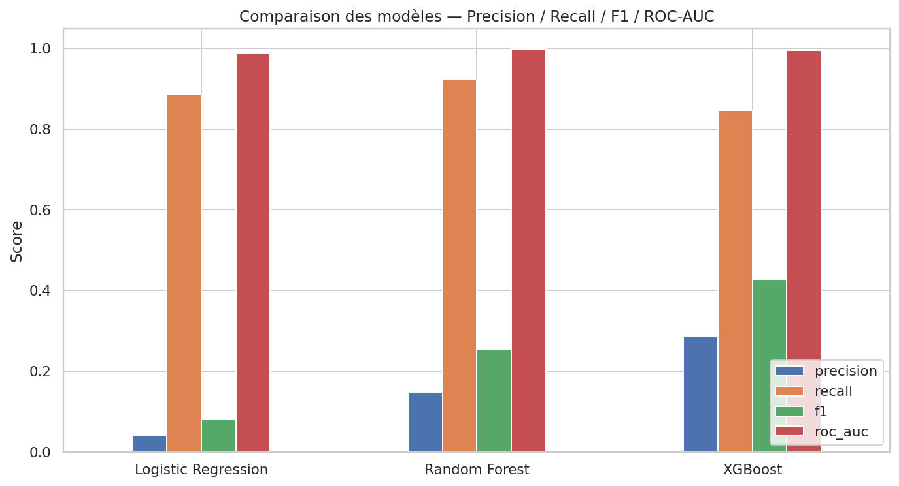
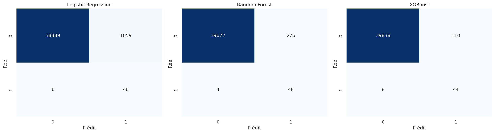
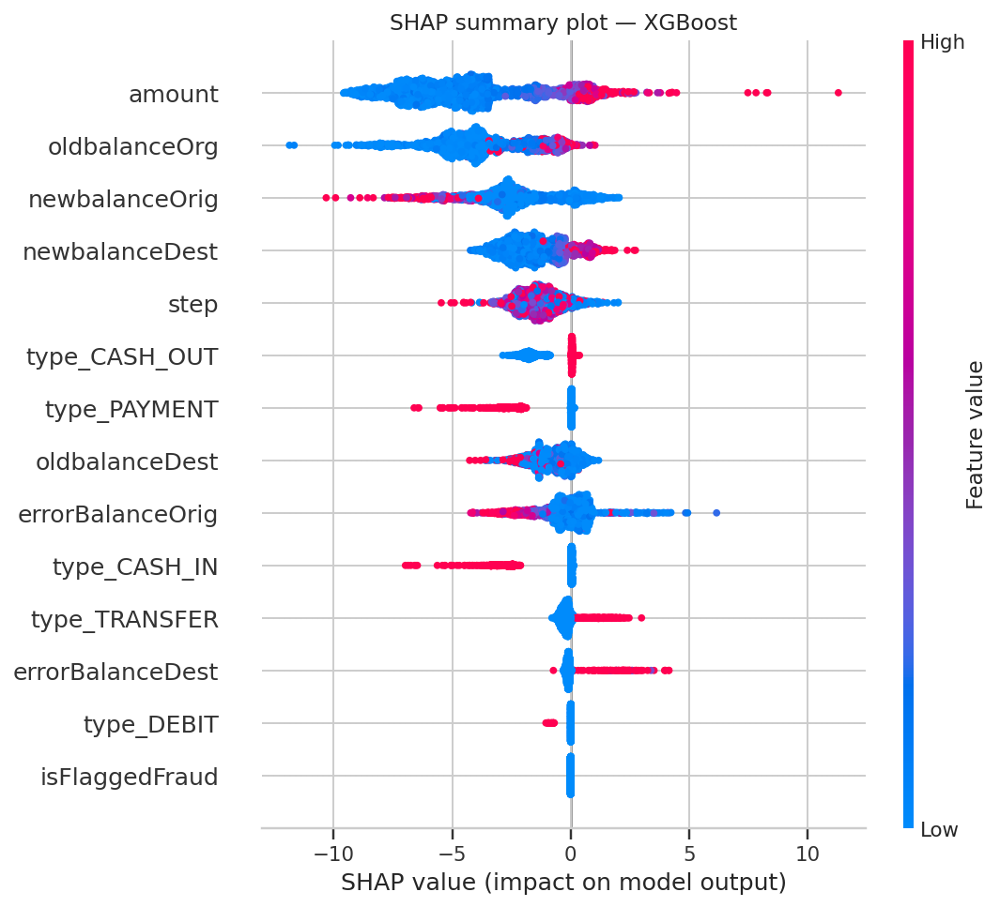

# 🏦 FraudGuard AI — fraud-detection-ml

Détection de fraude sur les paiements en ligne — pipeline ML complet (EDA, SMOTE, Logistic Regression / Random Forest / XGBoost, SHAP) livré sous **deux interfaces** avec des rôles différents : une démo Streamlit légère pour explorer le modèle rapidement, et une véritable application web (FastAPI + HTML/CSS/JS) comme produit final.


## Sommaire

- [Architecture](#architecture)
- [Dataset](#dataset)
- [Structure du projet](#structure-du-projet)
- [Installation](#installation)
- [Utilisation](#utilisation)
- [Méthodologie](#méthodologie)
- [Résultats](#résultats)
- [Pistes d'amélioration](#pistes-damélioration)

## Architecture

Le projet expose **deux interfaces indépendantes**, qui consomment le même modèle entraîné (`models/`) via la même logique de préparation des features (`src/preprocessing.py`), mais avec des objectifs différents :

```
                        FraudGuard AI
                             │
                 ┌───────────┴────────────┐
                 │                        │
           Streamlit                  FastAPI
        (Quick ML Demo)          (Full Web App)
                 │                        │
          prédiction rapide        HTML / CSS / JS
          + SHAP top factors              │
          + aperçu résultats       Dashboard complet
                                   Transaction Analysis
                                   Model Performance
                                   Explainable AI
                                           │
                                  XGBoost + SHAP (API REST)
```

| | Streamlit — Quick Demo | FastAPI + Web — Application complète |
|---|---|---|
| Objectif | Explorer et tester le modèle en 30 secondes | Produit final présentable, architecture séparée backend/frontend |
| Prédiction + SHAP | ✅ | ✅ |
| Dashboard / résultats | Aperçu (2 graphiques clés) | Complet (dashboard, model performance) |
| Frontend | Généré par Streamlit | HTML/CSS/JS fait main |
| API REST réutilisable | ❌ | ✅ (`/predict`, `/model-info`, `/health`) |
| Lancement | 1 commande (`streamlit run`) | 1 commande (`uvicorn`, sert aussi le frontend) |

**Pourquoi les deux ?** Ils ne démontrent pas les mêmes compétences : Streamlit prouve la capacité à itérer vite sur un modèle ML ; FastAPI + HTML/CSS/JS prouve la capacité à concevoir une vraie architecture web (API séparée du frontend, contrats de données typés avec Pydantic, CORS, etc.). Le contenu n'est pas dupliqué à l'identique — Streamlit reste volontairement une démo légère.

## Dataset

Le projet s'appuie sur le schéma du dataset **PaySim / Online Payments Fraud Detection** (Kaggle) : `step`, `type`, `amount`, `nameOrig`, `oldbalanceOrg`, `newbalanceOrig`, `nameDest`, `oldbalanceDest`, `newbalanceDest`, `isFraud`, `isFlaggedFraud`.

Le fichier original (~470 Mo, 6,3M lignes) est trop volumineux pour être versionné ici. `data/generate_sample_data.py` génère un jeu de données **synthétique** de 200 000 lignes qui reproduit fidèlement le schéma et les propriétés statistiques du dataset réel (déséquilibre ~0,13 %, fraude concentrée sur `TRANSFER`/`CASH_OUT`, incohérences de solde corrélées à la fraude).

**Pour utiliser le vrai dataset :** télécharger `onlinefraud.csv` depuis [Kaggle](https://www.kaggle.com/datasets/rupakroy/online-payments-fraud-detection-dataset), le placer dans `data/online-payments_fraud.csv`, puis relancer `src/train.py`.

## Structure du projet

```
fraud-detection-ml/
├── data/
│   └── generate_sample_data.py     # génère le dataset synthétique (schéma PaySim)
├── notebooks/
│   └── online_payments_fraud_detection.ipynb   # EDA + modélisation complètes
├── src/
│   ├── preprocessing.py            # feature engineering, partagé par les 2 apps + train.py
│   └── train.py                    # pipeline complet : EDA -> SMOTE -> modèles -> évaluation -> SHAP
├── app/
│   ├── streamlit/
│   │   └── app.py                  # Quick ML Demo
│   └── web/
│       ├── backend/
│       │   └── main.py             # API FastAPI (sert aussi le frontend)
│       └── frontend/
│           ├── index.html
│           ├── style.css
│           └── script.js
├── models/                         # modèles entraînés (.joblib), générés par train.py
├── reports/
│   ├── figures/                    # graphiques exportés par train.py
│   ├── model_comparison.csv
│   └── metrics.json
├── .streamlit/config.toml          # thème sombre de la démo Streamlit
├── requirements.txt
└── README.md
```

## Installation

```bash
git clone https://github.com/dohamly/fraud-detection-ml.git
cd fraud-detection-ml
python -m venv venv && source venv/bin/activate   # optionnel
pip install -r requirements.txt
```

## Utilisation

```bash
# 1. Générer le dataset (ou placer le vrai fichier Kaggle dans data/)
python data/generate_sample_data.py

# 2. Lancer le pipeline complet : EDA, SMOTE, entraînement, évaluation, SHAP, sauvegarde des modèles
python src/train.py
```

**Option A — Quick Demo (Streamlit) :**
```bash
streamlit run app/streamlit/app.py
```

**Option B — Application complète (FastAPI + frontend) :**
```bash
uvicorn app.web.backend.main:app --reload --port 8000
```
Ouvre ensuite `http://localhost:8000` (le frontend est servi directement par l'API) — et `http://localhost:8000/docs` pour la documentation Swagger auto-générée de l'API.

## Méthodologie

- **Split** stratifié train/test (80/20) *avant* tout rééquilibrage, pour une évaluation réaliste.
- **StandardScaler** ajusté sur le train uniquement.
- **SMOTE** appliqué après le split, sur le train uniquement (pas de fuite de données).
- Les trois modèles sont évalués sur l'ensemble de test **original** (non rééquilibré), pour refléter les conditions réelles de déploiement.

## Résultats

| Modèle | Accuracy | Precision | Recall | F1-score | ROC-AUC |
|---|---|---|---|---|---|
| Logistic Regression | 0.973 | 0.042 | 0.885 | 0.080 | 0.987 |
| Random Forest | 0.993 | 0.148 | 0.923 | 0.255 | 0.998 |
| **XGBoost** | **0.997** | **0.286** | 0.846 | **0.427** | 0.995 |

*(résultats obtenus sur le dataset synthétique fourni — à recalculer sur le vrai dataset Kaggle pour des chiffres de production)*

**XGBoost** offre le meilleur compromis precision/recall (meilleur F1-score) et est le modèle utilisé par les deux applications.





Le détail complet (courbes ROC, feature importance, EDA) est disponible dans `reports/figures/` et dans le notebook.

## Pistes d'amélioration

- Recalibrage complet sur le vrai dataset Kaggle (6,3M lignes).
- Recherche d'hyperparamètres (GridSearch / Optuna) pour chaque modèle.
- Seuil de décision ajustable selon le coût métier des faux positifs vs faux négatifs.
- Historique des transactions analysées + alertes (actuellement chaque prédiction est stateless, rien n'est stocké).
- Authentification sur l'API avant un déploiement public.
- Tests unitaires (`src/preprocessing.py`) + CI GitHub Actions.

## Licence

MIT — voir [LICENSE](LICENSE).
